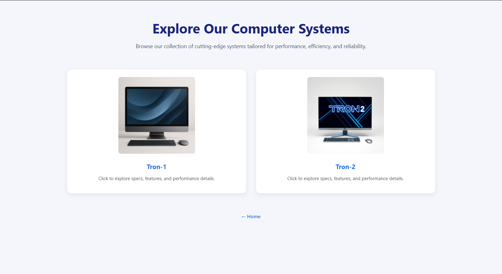

# SecureSys Vulnerable Web Application

SecureSys is a deliberately vulnerable web application built to demonstrate common web security flaws, including Cross-Site Scripting (XSS), Stored XSS, and SQL Injection, for educational and security testing purposes. Developed using Python (Flask) and PostgreSQL, and containerized with Docker, this project showcases my ability to identify, exploit, and mitigate vulnerabilities in a controlled environment. **This application is not intended for production use.**

---
## Table of Contents

- Project Overview
- Features
- Vulnerabilities
- Screenshots
- Patching the vulnerabilities

---
## Project Overview

SecureSys simulates a company website for a provider of All-in-One (AIO) systems, featuring an email submission form and a search function. The application is intentionally designed with vulnerabilities to study attack vectors like XSS and SQL Injection, reflecting real-world web security challenges. The project uses:

- Frontend: HTML, CSS (served via Flask templates)
- Backend: Python, Flask
- Database: PostgreSQL
- Deployment: Docker, Docker Compose

---
## Features

- Homepage: Includes a "Request a Quote" form where users submit an email address, redirecting to a thank-you page displaying the submitted email.
- Search Functionality: A navbar search bar allows querying system data (e.g., system names), with results displayed on a dedicated page.
- Admin Panel: Displays all submitted emails, currently accessible without authentication (vulnerable to unauthorized access).

---
## Vulnerabilities

The application contains the following intentional vulnerabilities for educational purposes:

1. Cross-Site Scripting (XSS) in Email Submission Form
    - **Description:** The "Request a Quote" form lacks input sanitization, allowing attackers to submit malicious JavaScript code in the email field. The code executes on the thank-you page when the email is displayed.
    - **Impact:** Attackers can steal user cookies, redirect users, or deface the page.

2. Stored Cross-Site Scripting (Stored XSS) in Admin Panel
    - **Description:** Malicious scripts submitted via the email form are stored in the PostgreSQL database and displayed unsanitized in the admin panel, executing when viewed by any user.
    - **Impact:** Persistent scripts can compromise admin sessions or affect all users accessing the panel.

3. SQL Injection via String Interpolation in Search Functionality
    - **Description:** The search function uses string interpolation to construct SQL queries despite base64-encoding the input as a naive sanitization attempt. Attackers can bypass this by crafting malicious base64-encoded queries, such as UNION-based injections.
    - **Impact:** Attackers can extract sensitive data (e.g., all emails in the database) or potentially expose admin panel credentials if stored.

---
## Screenshots

### Homepage


### Email Submission


### Systems


### System Specs


### Search


---
## Patching the Vulnerabilities

### 1. XSS in Email Submission

```py
    from flask import escape
    from bleach import clean

    #vulnerable function
    email = clean(request.form['email'], tags=[], attributes={})
    return render_template('thankyou.html', email=escape(email))
```

We escape the special characters and sanitize the email input by stripping all HTML tags and attributes.

### 2. SQLi

The SQLi arises due to **String Interpolation** in SQL query. It can be patched with parameterized queries.

```py
    cur.execute("SELECT * FROM systems WHERE name LIKE %s", (f'%{decoded_query}%',))
```

Utilizing RegEx will also further strengthen our defenses.

---

## Future Improvements

_I will continue to increase the attack vectors, perhaps even making some difficult to exploit in the future updates._
